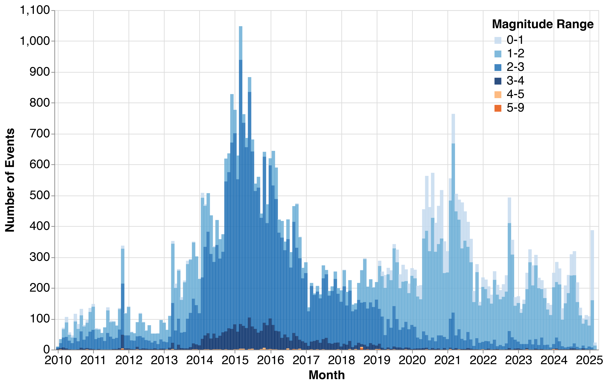
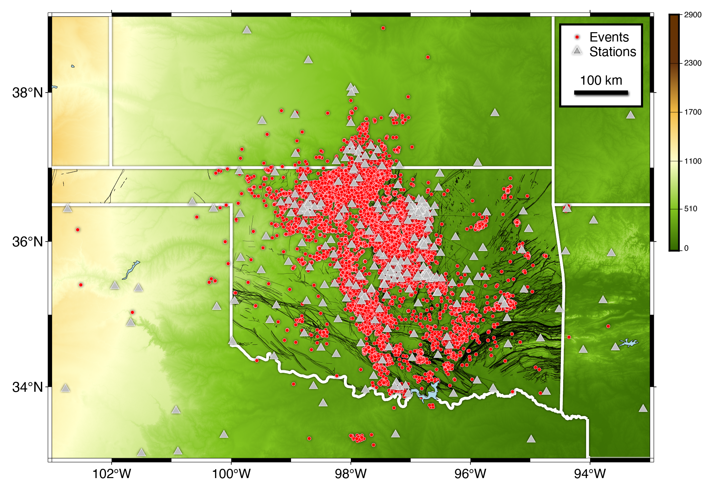
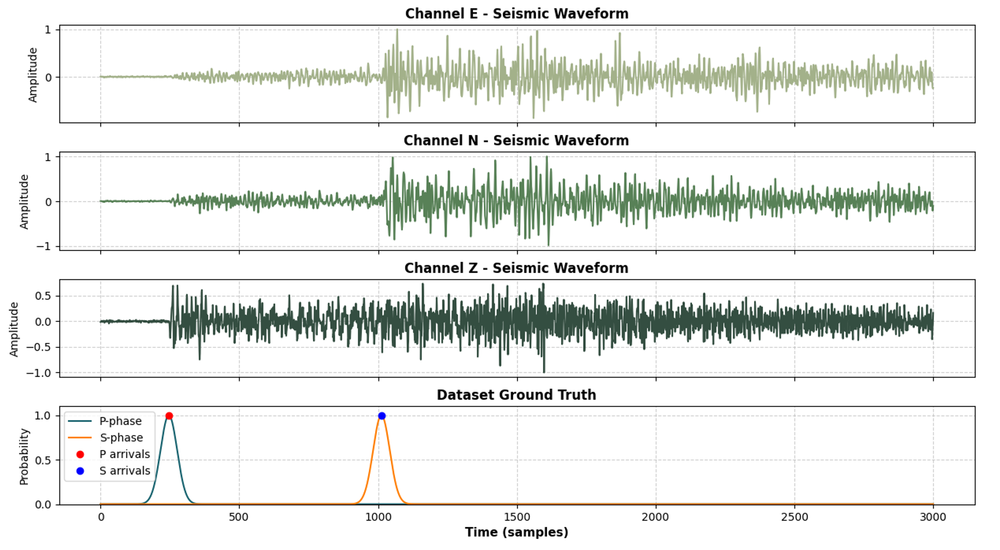
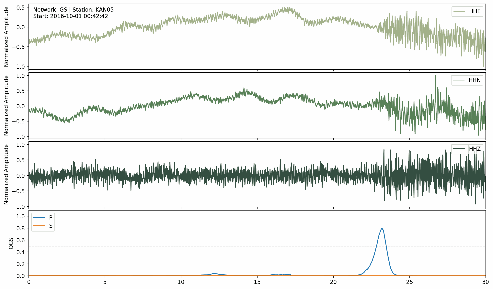

# OKLAD (Oklahoma labeled AI dataset) and SeisBench Tutorial

[](https://pypi.org/project/seisbench/0.7.0)
[](https://www.python.org/downloads/release/python-3120/)
[](https://developer.nvidia.com/cuda-toolkit-archive#12_1)
[](https://seisbench.readthedocs.io/)


[](https://opensource.org/licenses/GPL-3.0)
[](https://jupyter.org/)
[](https://github.com/Hy-X/seisbench-demos/stargazers)

By Dr.Hongyu Xiao @ University of Oklahoma

This repository provides a hands-on tutorial for **SeisBench**, a Python library for working with seismic datasets and machine learning models for seismology. It includes example scripts and Jupyter notebooks to get you started quickly.

## Repository Structure

```
seisbench-demos/
├── LICENSE
├── README.md
├── data/
│   └── 01_basic_dataset.hdf5
├── figures/
├── notebooks/
│   ├── 00_Intro_Env.ipynb
│   ├── 01_Basic_Usage.ipynb
│   ├── 02_Data_Preparation.ipynb
│   ├── 02_OKLAD_StatsPlot_Ver_6.ipynb
│   ├── 03_Model_Training.ipynb
│   ├── 04_Model_Evaluation.ipynb
│   ├── 05_Inference_Workflow.ipynb
│   ├── 06_Advanced_Visualization.ipynb
│   └── Learn_00_StationCheck.ipynb
└── scripts/
    ├── EQT_ModelTraining_256_0.01_SF0p1_Example/
    └── PNET_ModelTraining_64_0.01_20Percent_Example/
```

- **LICENSE**: Project license file.
- **notebooks/**: Jupyter notebooks demonstrating SeisBench usage interactively (multiple tutorial and utility notebooks).
- **scripts/**: Example training/run directories containing script artifacts and experiment folders.
- **data/** and **figures/**: Example dataset and visualization assets used by the notebooks.

## OKALD Glipmse and Statistics






## OKALD Flexible Labeling




## OKALD Annotation





## Setup

1. **Clone the repository:**

```bash
git clone https://github.com/Hy-X/seisbench-demos.git
cd seisbench-demos
```

2. **Create the Conda environment from `environment.yml` (recommended):**

```bash
conda env create -f environment.yml
conda activate seisbench-oklad
```

This recreates the exact environment used for the tutorial, including Python, SeisBench, PyTorch, and all dependencies.

3. **(Optional) Update the environment if new dependencies are added:**

```bash
conda env update -f environment.yml --prune
```

> GPU users: If you need a specific CUDA-enabled PyTorch version, follow the official PyTorch installation instructions and then update the environment accordingly.

## Usage

### Jupyter Notebook

Open the notebook to explore SeisBench interactively:

```bash
jupyter notebook notebooks/01_basic_usage.ipynb
```

### Python Scripts

Run the example script:

```bash
python scripts/01_basic_usage.py
```

## Contributing

Contributions are welcome! Feel free to submit issues or pull requests for additional tutorials, datasets, or models.

## License

This project is licensed under the GPL License.

