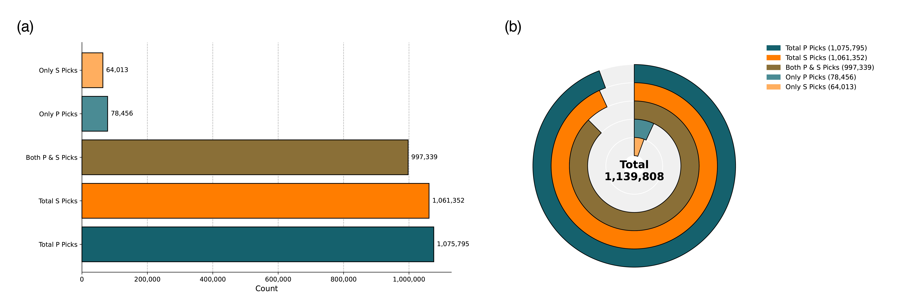

# OKLAD (Oklahoma labeled AI dataset) and SeisBench Tutorial

[](https://pypi.org/project/seisbench/0.7.0)
[](https://www.python.org/downloads/release/python-3120/)
[](https://seisbench.readthedocs.io/)
[](https://opensource.org/licenses/GPL-3.0)
[](https://jupyter.org/)
[](https://github.com/Hy-X/seisbench-demos/stargazers)


This repository provides a hands-on tutorial for **SeisBench**, a Python library for working with seismic datasets and machine learning models for seismology. It includes example scripts and Jupyter notebooks to get you started quickly.

## Repository Structure

```
seisbench-demos/
├── LICENSE
├── README.md
├── data/
│   └── 01_basic_dataset.hdf5
├── figures/
├── notebooks/
│   └── 01_basic_usage.ipynb
└── scripts/
    └── 01_basic_usage.py
```

- **LICENSE**: Project license file.
- **notebooks/**: Jupyter notebooks demonstrating SeisBench usage interactively.
- **scripts/**: Python scripts for running SeisBench workflows programmatically (example: `01_basic_usage.py`).
- **requirements.txt**: (optional) Python dependencies needed to run the tutorials.

## OKALD Statistics



## Setup

1. **Clone the repository:**

```bash
git clone https://github.com/Hy-X/seisbench-demos.git
cd seisbench-demos
```

2. **Create a Conda environment with Python 3.12 (recommended):**

```bash
# Create the environment (name it `seisbench-env` or choose your own)
conda create -n seisbench-env python=3.12 -y
# Activate the environment
conda activate seisbench-env
```

After activating the Conda environment, install the project dependencies:

```bash
pip install -r requirements.txt
```

If you plan to use GPU-accelerated PyTorch, prefer the Conda installation instructions from the PyTorch website (select the correct CUDA version), for example:

```bash
# Example (CPU-only):
conda install pytorch cpuonly -c pytorch -y
# Example (CUDA):
# conda install pytorch cudatoolkit=12.1 -c pytorch -y
```

3. **Install dependencies:**

```bash
pip install -r requirements.txt
```

> Ensure you have `seisbench` and optionally `torch` installed. If you are using GPU, install the corresponding CUDA version for PyTorch.

## Usage

### Jupyter Notebook

Open the notebook to explore SeisBench interactively:

```bash
jupyter notebook notebooks/01_basic_usage.ipynb
```

### Python Scripts

Run the example script:

```bash
python scripts/01_basic_usage.py
```

## Contributing

Contributions are welcome! Feel free to submit issues or pull requests for additional tutorials, datasets, or models.

## License

This project is licensed under the GPL License.

