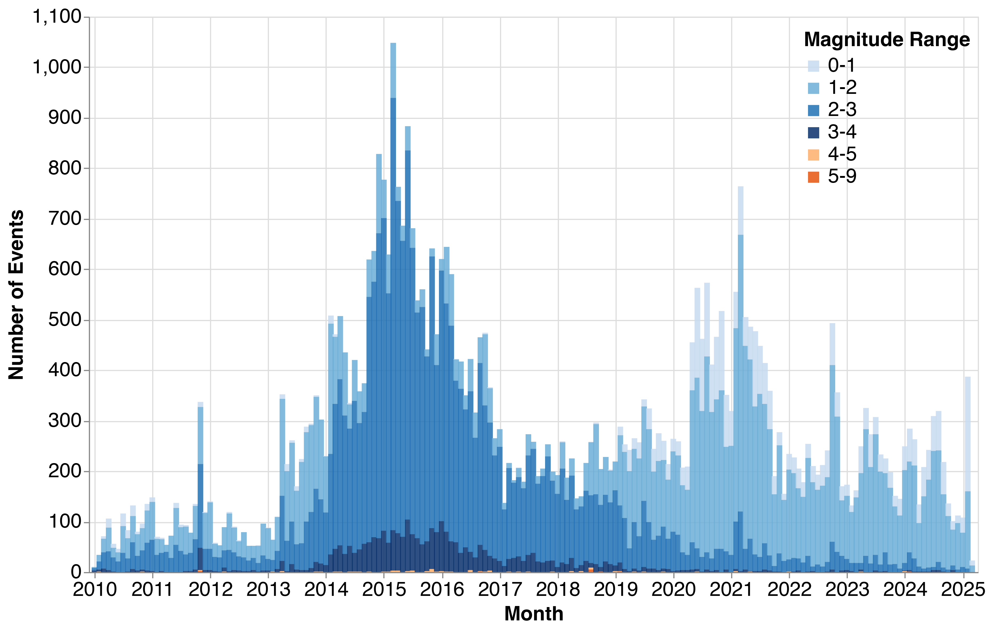
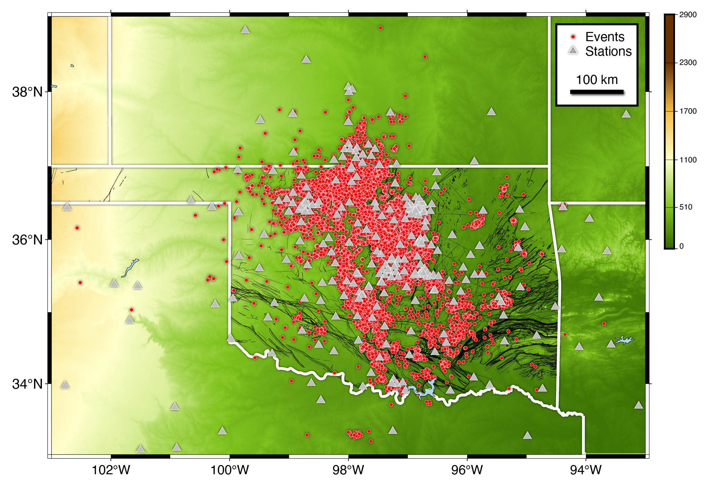
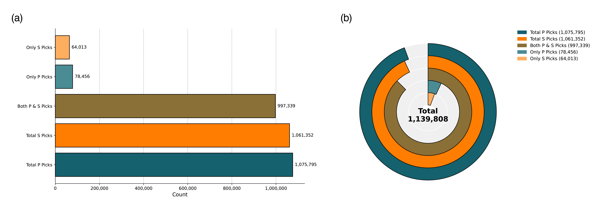
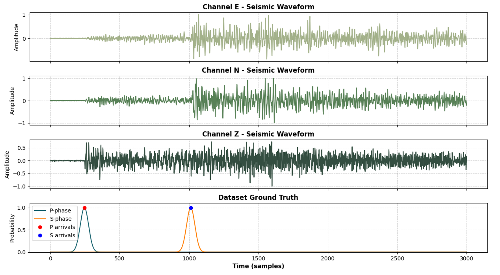
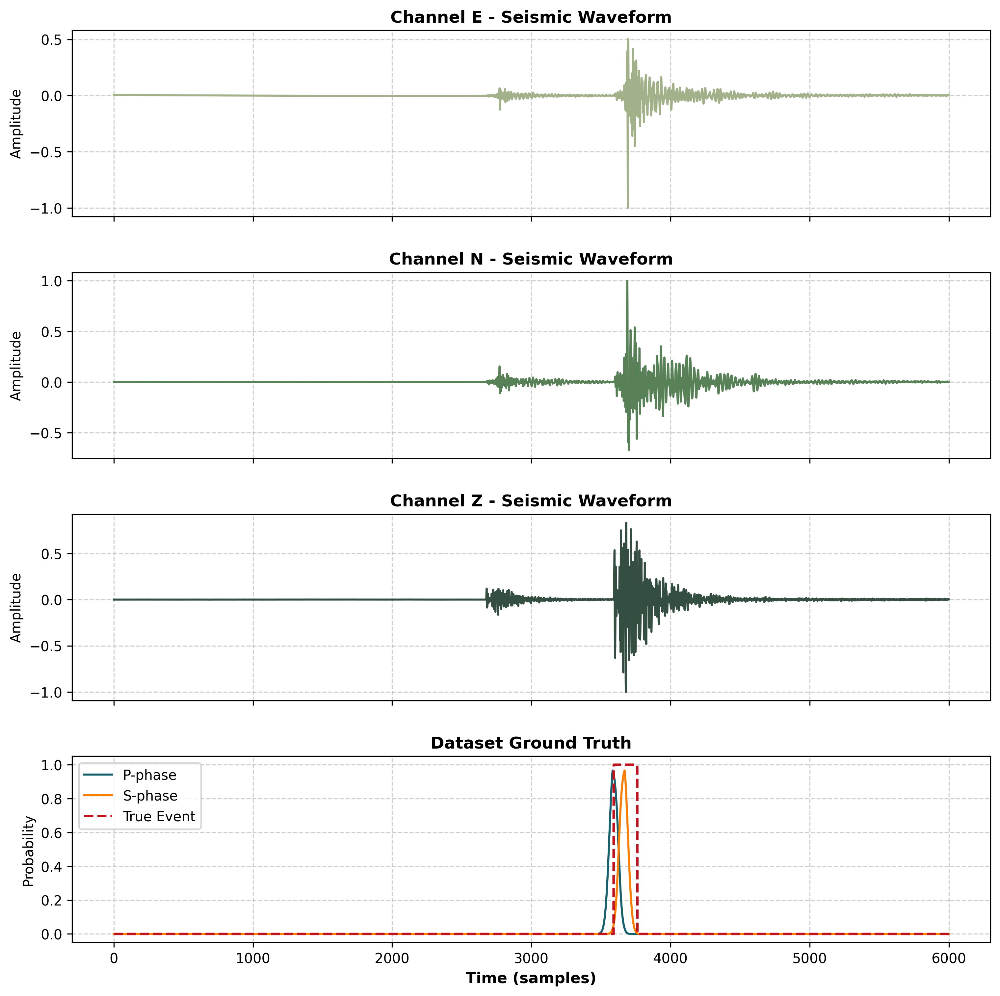
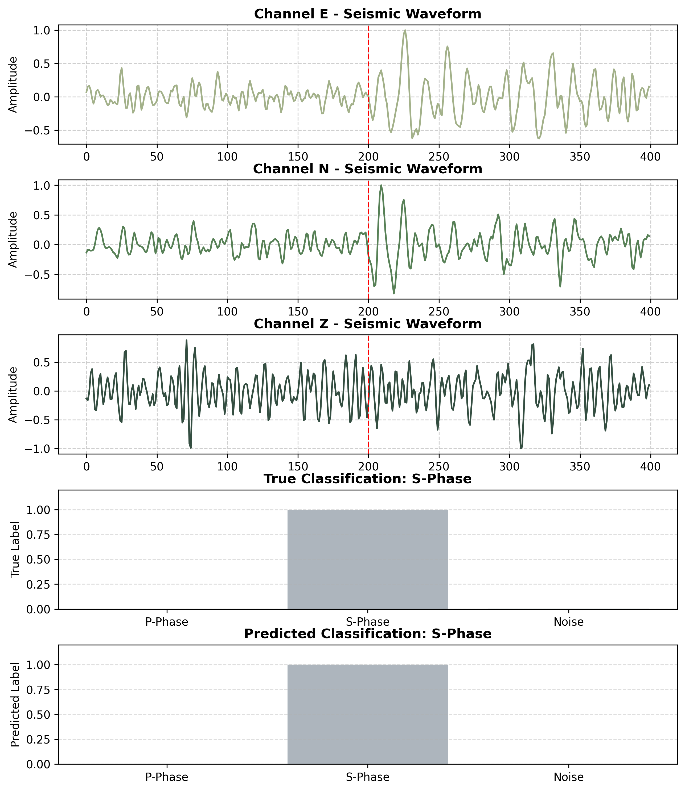
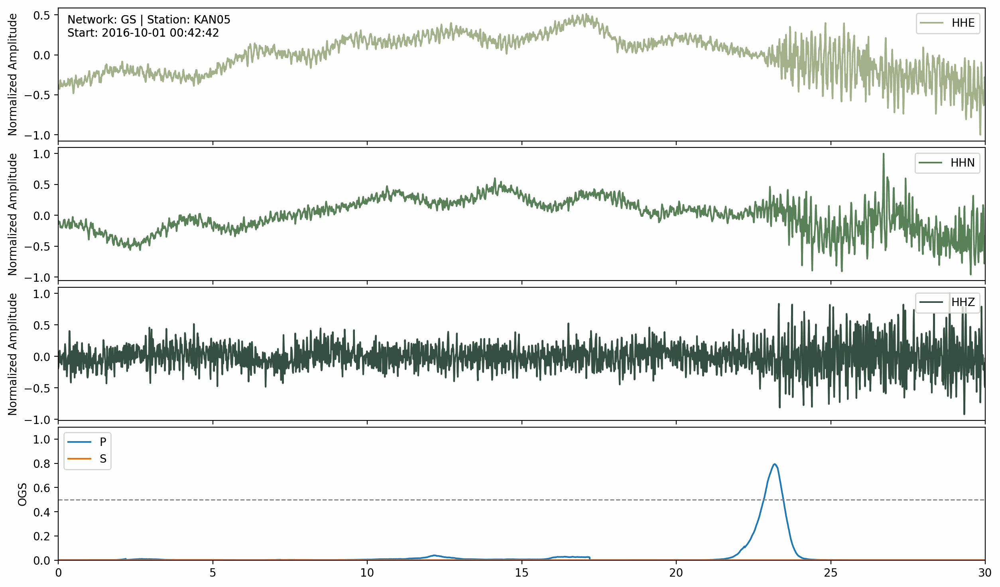

# OKLAD (Oklahoma labeled AI dataset) and SeisBench Tutorial

[](https://pypi.org/project/seisbench/0.7.0)
[](https://www.python.org/downloads/release/python-3120/)
[](https://developer.nvidia.com/cuda-toolkit-archive#12_1)
[](https://pytorch.org/)

[](https://seisbench.readthedocs.io/)
[](https://opensource.org/licenses/GPL-3.0)
[](https://jupyter.org/)
[](https://github.com/Hy-X/seisbench-demos/stargazers)
[](https://doi.org/10.1029/2025JH001194)


By Hongyu Xiao @ University of Oklahoma

This repository provides a hands-on tutorial for **Seisbench**, a Python library for working with seismic dataset and machine learning models for seismology. It includes example scripts and Jupyter notebooks to get you started quickly.

In addtion to the core Seisbench examples, this repository features the OKLAD induced-seismicity dataset. A curated collection of local microearthquake recordings with higher fidelity annotations from the Oklahoma region. The dataset captures a wide range of induced seismic events, making it ideal for demonstrating practical tasks such as waveform inspection, labelling strategies, preprocessing workflows and model fine-tuning.

The notebooks included in this repository will walk you through:

1 loading and exploring the OKLAD dataset
2 applying Seisbench's building preprocessing tools
3 adapting pretrained models to the OKLAD data for event detection and picking
4 configuring the environment so others can easily reproduce or extend workflow

## Published Paper

**Transfer Learning and Benchmarking for Induced Seismic Event Detection: Insights From Oklahoma**

*Journal of Geophysical Research: Machine Learning and Computation*, Vol. 3, Issue 4, e2025JH001194 (2026)

📄 [Read the Paper](https://doi.org/10.1029/2025JH001194) | Published: July 6, 2026 (Online) | Open Access

**Authors:** Hongyu Xiao, Jacob I. Walter, Paul Ogwari, Long M. Ho, Andrew D. Thiel, Nicholas Gregg, Brandon Mace, Isaac Woelfel
*(Oklahoma Geological Survey, University of Oklahoma; The University of Alabama)*

**Keywords:** microseismicity detection · transfer learning · induced seismicity · OKLAD (Oklahoma labeled AI dataset)

### Abstract

Machine learning models for microseismicity detection are often limited by the scarcity of large and high-quality labeled data sets in many regions. To address this need, we introduce the **Oklahoma Labeled AI Dataset (OKLAD)**, a manually curated data set compiled by the Oklahoma Geological Survey (OGS). OKLAD is designed to support studies of induced seismicity and serves as a benchmark for evaluating deep-learning detection models in local and regional monitoring contexts. Using OKLAD, we fine-tuned several established phase-picking models and observed substantial improvement in local and regional detection. The best performing model achieved recalls of **91.1% for first arrival P-wave detection** and **89.8% for first arrival S-wave detection**. Validating this model on continuous data in Oklahoma, we recovered **96.8% of the OGS-cataloged events** and identified **146.8% more events** after associative comparison with the events reported by routine network operations. Comparable improvements were also observed when applying the best performing models to other induced seismicity settings, such as west Texas. These results establish OKLAD as a benchmark data set for induced seismicity and demonstrate the effectiveness of transfer learning for improving regional seismic monitoring. This approach provides a replicable framework for enhancing microseismicity detection in challenging environments and can be extended to other regions where generalized deep-learning pickers may underperform.

### Plain Language Summary

Human activities such as wastewater injection and hydraulic fracking can trigger earthquakes. In the southern midcontinent of the U.S., such induced earthquakes have become more prominent in the last decade. However, the ground vibration signals of small induced earthquakes are often buried in environmental noise, making them difficult to detect using traditional methods or through visual inspection by seismic analysts. In this study, we fine-tuned machine learning models using an Oklahoma-focused data set (OKLAD) and compared their performance to existing models. Our results show that even with a relatively small amount of localized data, the models' ability to detect small earthquakes can be substantially improved. Applying the best model to 2022 data, we recovered nearly all previously cataloged events while **identifying more than 4,400 additional events**. These results show that OKLAD can serve as a benchmark for earthquake detection and that transfer learning is an effective strategy for applying machine learning across regions. We are releasing both our trained models and the data set to the public to support future research on induced earthquakes.

### Key Results

| Metric | Value |
|--------|-------|
| P-wave detection recall (best model) | **91.1%** |
| S-wave detection recall (best model) | **89.8%** |
| OGS catalog recovery rate (2022, continuous data) | **96.8%** |
| Additional events identified beyond catalog | **+146.8%** (~4,400+ new events) |
| Transferability to west Texas induced seismicity | ✅ Demonstrated |

## OKLAD Dataset Overview

OKLAD (**OK**lahoma **L**abeled **A**I **D**ataset) was curated from the Oklahoma Geological Survey earthquake catalog spanning **2010–2024**.

| Property | Value |
|----------|-------|
| Total events | **52,193** |
| Total waveform traces | **1,139,808** |
| Seismic stations | **311** (temporary, long-term, and permanent) |
| Coverage period | 2010–2024 |
| Sampling rate | 100 Hz |
| Trace length | 120 s (60 s before + 60 s after origin time) |
| Coordinate system | ENZ (rotated) |
| Networks covered | Oklahoma, Kansas, Missouri, Texas, Arkansas |

**Phase pick statistics:**

| Category | Count | % of Dataset |
|----------|-------|--------------|
| Total P Picks | 1,075,795 | 94.38% |
| Total S Picks | 1,061,352 | 93.12% |
| Both P & S Picks | 997,339 | 87.50% |
| Only P Picks | 78,456 | 6.88% |
| Only S Picks | 64,013 | 5.62% |

> **Note:** Continuous waveform data are archived at the EarthScope SAGE Data Management Center (formerly IRIS). The dataset is regularly updated by the OGS.

## Repository Structure

```
seisbench-demos/
├── LICENSE
├── README.md
├── data/
│   └── 01_basic_dataset.hdf5
├── figures/
├── notebooks/
│   ├── 00_Intro_Env.ipynb
│   ├── 01_Basic_Usage.ipynb
│   ├── 02_Data_Preparation.ipynb
│   ├── 02_OKLAD_StatsPlot_Ver_6.ipynb
│   ├── 03_Model_Training.ipynb
│   ├── 04_Model_Evaluation.ipynb
│   ├── 05_Inference_Workflow.ipynb
│   ├── 06_Advanced_Visualization.ipynb
│   └── Learn_00_StationCheck.ipynb
└── scripts/
    ├── EQT_ModelTraining_256_0.01_SF0p1_Example/
    └── PNET_ModelTraining_64_0.01_20Percent_Example/
```

- **LICENSE**: Project license file.
- **notebooks/**: Jupyter notebooks demonstrating SeisBench usage interactively (multiple tutorial and utility notebooks).
- **scripts/**: Example training/run directories containing script artifacts and experiment folders.
- **data/** and **figures/**: Example dataset and visualization assets used by the notebooks.

## OKALD Glipmse and Statistics







## OKALD Flexible Labeling







## OKALD Annotation





## Setup

1. **Clone the repository:**

```bash
git clone https://github.com/Hy-X/seisbench-demos.git
cd seisbench-demos
```

2. **Create the Conda environment from `environment.yml` (recommended):**

```bash
conda env create -f environment.yml
conda activate seisbench-oklad
```

This recreates the exact environment used for the tutorial, including Python, SeisBench, PyTorch, and all dependencies.

3. **(Optional) Update the environment if new dependencies are added:**

```bash
conda env update -f environment.yml --prune
```

> GPU users: If you need a specific CUDA-enabled PyTorch version, follow the official PyTorch installation instructions and then update the environment accordingly.

## Usage

### Jupyter Notebook

Open the notebook to explore SeisBench interactively:

```bash
jupyter notebook notebooks/01_basic_usage.ipynb
```

### Python Scripts

Run the example script:

```bash
python scripts/01_basic_usage.py
```

## Contributing

Contributions are welcome! Feel free to submit issues or pull requests for additional tutorials, datasets, or models.

## Citation

If you use this repository, the OKLAD dataset, or the trained models in your research, please cite:

**APA Style:**
> Xiao, H., Walter, J. I., Ogwari, P., Ho, L. M., Thiel, A. D., Gregg, N., Mace, B., & Woelfel, I. (2026). Transfer learning and benchmarking for induced seismic event detection: Insights from Oklahoma. *Journal of Geophysical Research: Machine Learning and Computation*, 3(4), e2025JH001194. https://doi.org/10.1029/2025JH001194

**BibTeX:**
```bibtex
@article{xiao2026,
  author = {Xiao, Hongyu and Walter, Jacob I. and Ogwari, Paul and Ho, Long M. and Thiel, Andrew D. and Gregg, Nicholas and Mace, Brandon and Woelfel, Isaac},
  title = {Transfer Learning and Benchmarking for Induced Seismic Event Detection: Insights From Oklahoma},
  journal = {Journal of Geophysical Research: Machine Learning and Computation},
  volume = {3},
  number = {4},
  pages = {e2025JH001194},
  year = {2026},
  doi = {10.1029/2025JH001194},
  url = {https://doi.org/10.1029/2025JH001194}
}
```

## License

This project is licensed under the GPL License.
